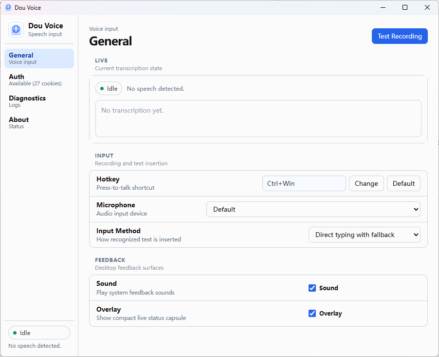

# Dou Voice

Dou Voice 是一个多平台的桌面语音输入工具，它把豆包 Web 端的 ASR 能力封装成 press-to-talk 体验，让你在任何输入框里都能用语音输入。

> ⚠️ 纯 Vibe Coding 警告！! 



## 主要功能

- 全局 press-to-talk 热键，默认 `Ctrl+Q`，录音时不抢占当前窗口焦点。
- 实时录音上传到豆包 ASR，松开热键后等待识别结果并自动输入。
- 文本输入支持直接键入（失败时自动回退到剪贴板粘贴），也支持只写入剪贴板让你手动粘贴。
- 底部 overlay 浮层显示录音状态、实时文本和麦克风波形。
- 系统托盘图标随状态变化，提示音反馈录音开始、结束和错误。
- 首次使用 setup wizard，引导登录、选择麦克风、配置热键和验证链路。
- 脱敏诊断导出，便于排障时不泄露敏感信息。

## 平台支持

| 平台 | 状态 |
| --- | --- |
| Windows | 主验证路径，全部功能可用。 |
| macOS | 已构建可用包，需要在真机上验证麦克风权限、辅助功能权限、全局热键和输入模拟；当前 artifact 未做开发者签名和 notarization。 |
| Linux | 已构建 deb / AppImage 包，需要按 X11 / Wayland / 桌面环境分别验证全局热键、输入模拟和 overlay 行为。 |

## 获取应用

Dou Voice 目前没有公开发布的安装包。你可以通过以下两种方式获取：

- **下载 CI 构建产物**：从仓库的 GitHub Actions 产物下载对应平台的 bundle（Windows NSIS、macOS bundle、Linux deb/AppImage）。macOS 包未签名，首次打开可能被 Gatekeeper 拦截。
- **从源码构建**：需要 Rust stable（≥ 1.78）和 Bun。Windows 还需要 WebView2 Runtime。具体步骤见 [开发与验证](docs/development.md) 的「常用命令」和「打包」章节，应用层使用说明见 [桌面应用说明](apps/dou-voice-desktop/README.md)。

构建完成后，应用目录是 `apps/dou-voice-desktop`。

## 首次配置

首次启动时应用会进入 setup wizard，引导你完成四步：

1. **Doubao Session**：点击 `Open Login` 打开豆包登录窗口，登录后回到 wizard 点击 `Export Auth`，再点 `Refresh` 确认认证可用。
2. **Input Basics**：选择麦克风、文本插入方式、是否启用 overlay 和提示音。
3. **Press To Talk**：保留默认 `Ctrl+Q`，或点击 `Change` 捕获新的热键。
4. **Ready Check**：点击 `Test Recording` 运行一次 5 秒测试录音，确认能录音、识别和输入，然后 `Finish Setup`。

完成后主窗口进入常规设置界面，系统托盘区会出现 Dou Voice 图标。

## 日常使用

1. 把光标放到目标输入框（任何能接收文本的程序都可以）。
2. 按住热键（默认 `Ctrl+Q`）开始录音，overlay 会浮在屏幕底部显示录音状态、实时文本和麦克风波形。
3. 正常说话。
4. 松开热键，应用停止录音并等待 ASR 返回最终结果。
5. 识别文本按你的设置自动输入到当前焦点窗口，或写入剪贴板等待手动粘贴。

如果识别或输入过程中再次按下热键，应用会忽略本次按下并提示上一段还没完成。

## 设置项

主窗口的 `General` 页可以随时修改：

- **Hotkey**：默认 `Ctrl+Q`。Windows 支持两个及以上修饰键的组合。
- **Microphone**：默认使用系统默认输入设备。所选设备不可用时回退到默认设备。
- **Input Method**：
  - `Direct typing with fallback`：先尝试直接输入；失败时自动备份剪贴板、写入识别文本、发送粘贴快捷键并还原剪贴板。
  - `Clipboard paste`：只把识别文本写入剪贴板，不自动粘贴，由你手动 `Ctrl+V`。
- **Sound**：开关录音、停止、完成和错误提示音。
- **Overlay**：开关底部状态浮层。

`Auth` 页可以查看认证状态、认证文件路径、重新打开登录窗口和重新导出认证。`Diagnostics` 页可以查看最近活动日志并导出脱敏诊断文件。`About` 页显示当前运行配置摘要。

关闭主窗口不会退出应用；要从托盘菜单点击 `Quit` 才会完全退出。双击托盘图标可以重新打开主窗口。

## 隐私与数据

Dou Voice 本地保存以下文件（Windows 下通常位于 `%APPDATA%\dou.voice\`）：

| 文件 | 说明 |
| --- | --- |
| `auth.json` | 豆包登录态，包含 Cookie、`device_id`、`web_id`。敏感文件，不要提交或粘贴到任何公开位置。 |
| `settings.json` | 热键、输入方式、麦克风、音效、overlay 等用户设置。 |
| `diagnostics/diagnostics-*.json` | 脱敏诊断文件，包含状态、事件、ASR 配置摘要和 auth 摘要。 |

诊断导出不会写出 Cookie、`device_id`、`web_id` 原文，可以安全地附在 issue 里帮助排障。麦克风音频只用于实时识别上传，不会落盘保存。

## 常见问题

### 登录后认证不可用 / Cookie 数量很少

确认登录窗口仍打开且页面已成功登录。点击 `Export Auth` 后再点 `Refresh`。如果仍不可用，关闭登录窗口重新打开并重新登录，不要手工编辑 Cookie。

### 按热键后没有输入文本

打开 `Diagnostics` 页查看活动日志：

- 如果没有 `asr_final` 或 `final_text`，优先检查认证、麦克风和网络。
- 如果有 `final_text` 但没有输入，查看是否有 `input_fallback` 或 `failed to type text`。
- 如果选择了 `Clipboard paste`，需要手动粘贴。
- 如果目标程序以管理员权限运行，普通权限应用的输入模拟可能被系统拦截。Windows 上可以尝试用管理员权限运行 Dou Voice。

### Overlay 不显示

确认 `General` 页 `Overlay` 已开启。在 idle 状态且没有最新文本时 overlay 会隐藏；错误或 idle 状态会延迟隐藏。

### macOS 下载包提示「已损坏」或无法打开

当前 macOS artifact 没有开发者签名和 notarization，Gatekeeper 会拦截。可以临时在终端通过如下命令解决：

```
xattr -c /Applications/DouVoice.app
```

## 更多文档

- [桌面应用说明](apps/dou-voice-desktop/README.md)
- [Windows 使用与排障](docs/windows-desktop.md)
- [开发与验证](docs/development.md)（构建、CI、打包、验证边界）
- [架构说明](docs/architecture.md)（分层、ASR 链路、热键、状态机）
